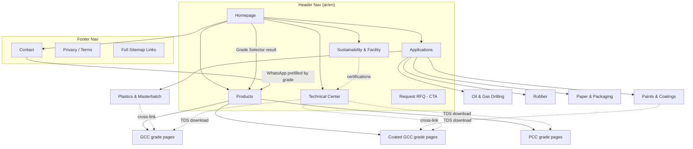

# Site Architecture — KMIT Industrial

*Phase 0 deliverable. Site type: hybrid B2B industrial manufacturer site (marketing + technical product center), bilingual AR (default) / EN.*

## 1. Locale & URL Decision (locked)

Both languages carry an explicit prefix — `/ar/...` and `/en/...` — with `/ar` as the default locale content-wise (per governing brief) but **not** an unprefixed root. Rationale: avoids ambiguity for `hreflang` (`ar-SA`, `en-SA`, `x-default`), keeps `next-intl` routing symmetric, and prevents duplicate-content risk between `/` and `/ar/`. `/` redirects (308) to `/ar`. `x-default` points to `/ar`.

## 2. Page Hierarchy (ASCII Tree)

```
/ (→ 308 redirect to /ar)
/{locale}                                          Homepage
├── /{locale}/products                             Products listing (GCC / Coated GCC / PCC, filterable)
│   └── /{locale}/products/{slug}                  Single grade page (e.g. /products/gcc-fine-40)
├── /{locale}/applications                          Applications overview (sector grid)
│   └── /{locale}/applications/{sector}             Single sector deep-dive
│       (sectors: plastics-masterbatch, paints-coatings, oil-gas-drilling, rubber, paper-packaging)
├── /{locale}/technical-center                      TDS/MSDS hub, downloadable docs, comparison tables
├── /{locale}/sustainability-and-facility            Mining/PCC/GCC process timeline, CCUS, responsible mining
├── /{locale}/contact                                Contact + full RFQ form + office/plant map
└── /{locale}/legal/{page}                           Privacy, Terms (footer-only, not in primary nav)

/api/rfq                                             RFQ form submission endpoint (not a page)
/sitemap.xml  /robots.txt  /opengraph-image           Technical/SEO endpoints
/llms.txt                                             AEO/GEO machine-readable summary
```

**Depth check:** every page reachable within 2 clicks from homepage (Home → L1 → L2 max). Satisfies the 3-click rule with margin.

## 3. Visual Sitemap (Mermaid)



## 4. URL Map Table

| Page | URL (ar / en) | Parent | Nav Location | Priority |
|---|---|---|---|---|
| Homepage | `/ar` · `/en` | — | Header logo | High |
| Products listing | `/ar/products` · `/en/products` | Home | Header | High |
| Single product/grade | `/ar/products/{slug}` · `/en/products/{slug}` | Products | Products dropdown, cross-links | High |
| Applications overview | `/ar/applications` · `/en/applications` | Home | Header | High |
| Single application sector | `/ar/applications/{sector}` · `/en/applications/{sector}` | Applications | Applications grid | Medium |
| Technical Center (TDS/MSDS hub) | `/ar/technical-center` · `/en/technical-center` | Home | Header | High |
| Sustainability & Facility | `/ar/sustainability-and-facility` · `/en/sustainability-and-facility` | Home | Header | Medium |
| Contact + RFQ | `/ar/contact` · `/en/contact` | Home | Header CTA area | High |
| Legal pages | `/ar/legal/{page}` · `/en/legal/{page}` | — | Footer only | Low |

## 5. Navigation Spec

**Header nav (5 items + CTA — within the 4-7 item rule):**
`Products (dropdown) · Applications · Technical Center · Sustainability & Facility · [locale switcher] → Request RFQ (CTA, rightmost in LTR / leftmost in RTL via logical `start`/`end`, never hardcoded left/right)`

- Products dropdown shows the 3 families (GCC / Coated GCC / PCC) with mesh range + primary use, per section 5.1 of the brief.
- Top bar (above main nav): sales phone, email, "Supplying KSA & GCC" badge with KSA flag, language switcher (cookie-persisted, preserves current path on toggle).
- Floating action bar: WhatsApp + phone, logical-end positioned, hide-on-scroll-down / show-on-stop.

**Footer sections:**
- **Products:** GCC, Coated GCC, PCC, full products listing link.
- **Applications:** all 5 sector links.
- **Company:** Sustainability & Facility, Technical Center, Contact.
- **Legal:** Privacy, Terms, and a full text sitemap link (accessibility + crawl aid).
- Certifications badges (ISO 9001 / SASO / REACH) and commercial registration data live in the footer per brief section 5.1.

**Breadcrumbs:** mirror the URL path on every L2 page, e.g. `الرئيسية > المنتجات > GCC Fine 40` / `Home > Products > GCC Fine 40`. Rendered as `BreadcrumbList` JSON-LD too (Phase 6).

## 6. Internal Linking Plan

**Hub pages:**
- `/products` is the hub for all grade pages; `/technical-center` is the hub for all TDS/MSDS downloads — every grade page links back to both.
- Each `/applications/{sector}` page cross-links to the specific product grades it recommends (e.g. Oil & Gas Drilling → PCC/GCC grades suited for drilling mud), and the homepage Grade Selector deep-links into `/products/{slug}` with query state.

**Cross-section links:**
- Grade page → relevant application sector(s) ("used in: Paints & Coatings, Plastics & Masterbatch").
- Application sector page → 2-3 recommended grade pages with the technical reason, not generic "view products."
- Sustainability & Facility → Technical Center (certifications referenced there should link to the actual TDS/MSDS hub).
- Contact page WhatsApp CTA carries the last-viewed grade code into the prefilled message (per brief section 5.4).

**Orphan-page audit:** none possible at launch — every L2 page is reachable from its L1 parent nav and cross-linked from at least one other section (product ↔ application).

## 7. Data Note

Products/applications/sectors above are named per the master brief (section 5.1–5.4) and the 5 image categories found in `/public/Images/`. The brief's Grade Selector lists 6 industries (PVC, Masterbatch, Paints, Drilling mud, Rubber, Paper) — `applications/{sector}` should ultimately cover all 6; current image assets only clearly cover Plastics & Masterbatch (combined), Paints & Coatings, Oil & Gas Drilling, and Paper & Packaging. Rubber has no dedicated asset yet — see `ASSETS-GAP.md`.
